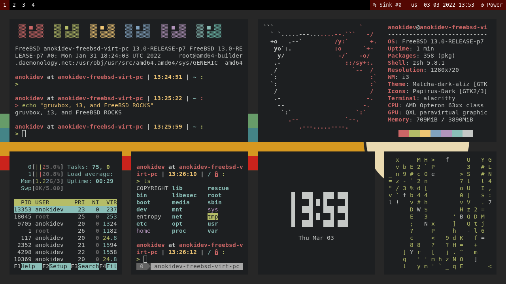
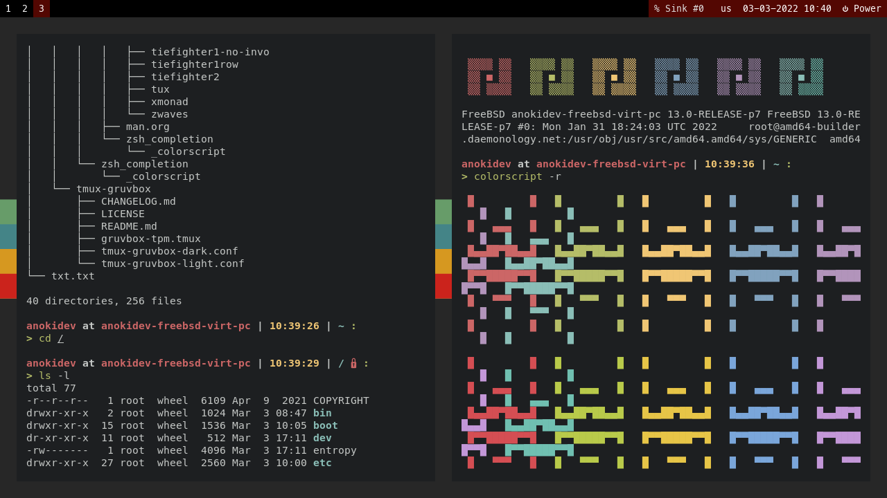

		<h1>Dotfiles</h1>
		
		
		
		

This is used to store all my dotfiles.
Licensed in MIT License.

- personal-rice-dotfiles : For my personal PC, which I used for work.
- freebsd-rice-dotfiles : For my FreeBSD VM, which is created for r/unixporn.
