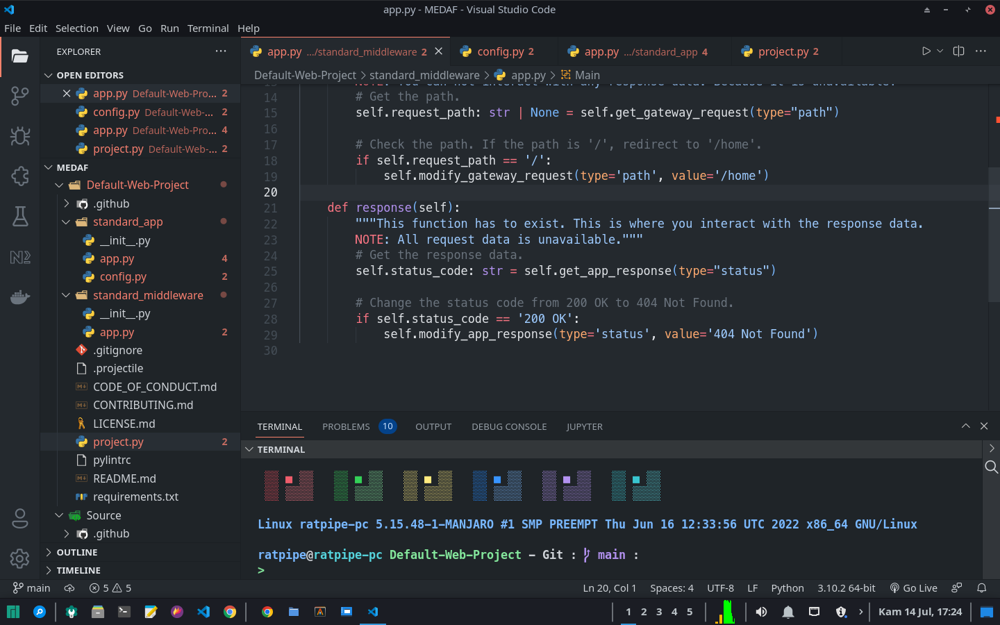
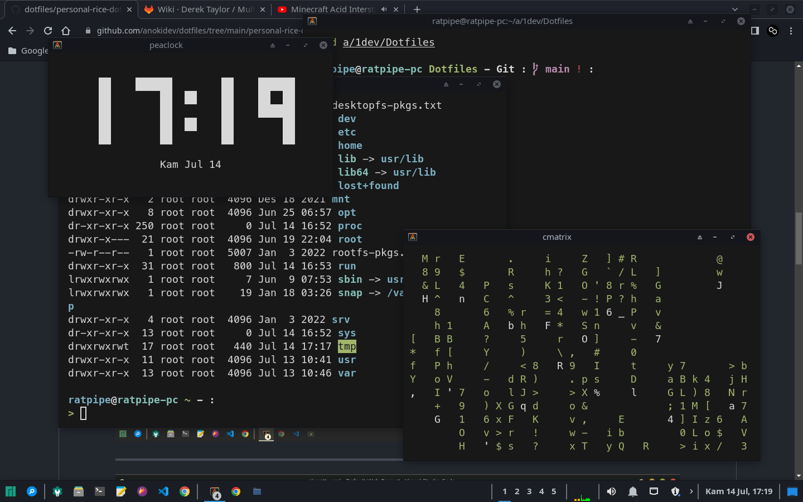
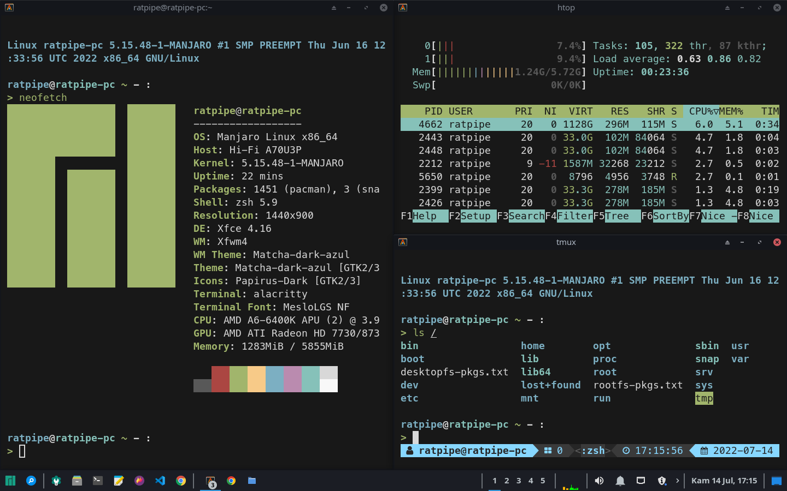

		<h1>Dotfiles</h1>
		
		
		
		
		

## About:

This is used to store all my dotfiles.
Licensed in MIT License.

- [personal](./personal/README.md) : For my personal PC, which I used for work.
- [freebsd](./freebsd/README.md) : For my FreeBSD VM, which is created for r/unixporn.
