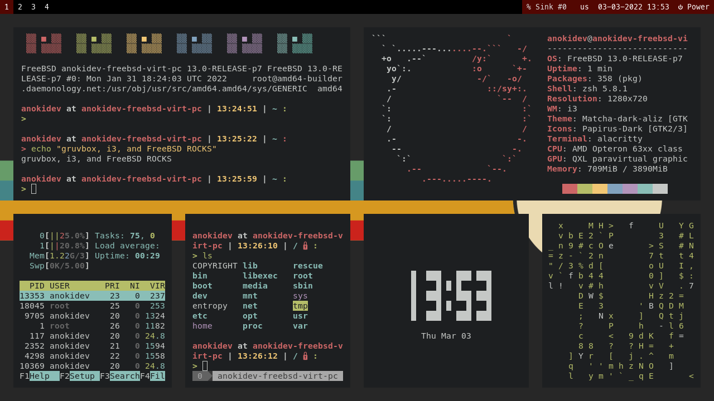
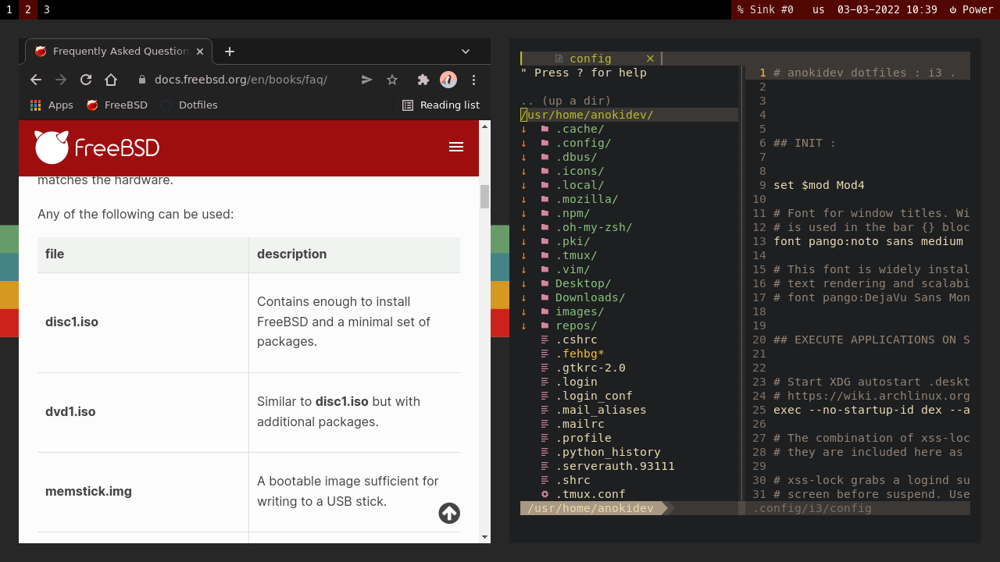
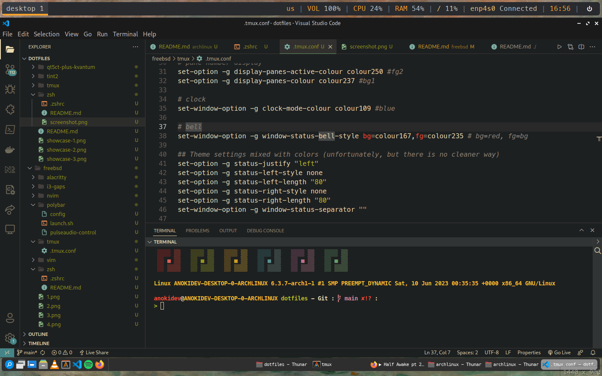
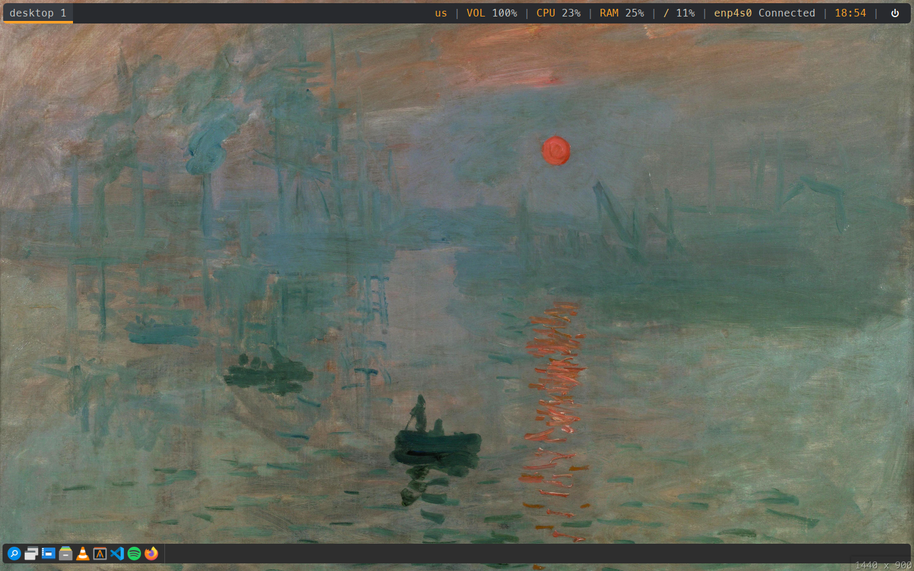

		<h1>Dotfiles</h1>
		
		
		
		

## About:

This is used to store all my dotfiles.
The dotfiles are licensed in MIT License.

- [Arch Linux](./archlinux/README.md) : For my Arch PC, which I used for work.
- [FreeBSD](./freebsd/README.md) : For my FreeBSD VM, which was created for r/unixporn.
