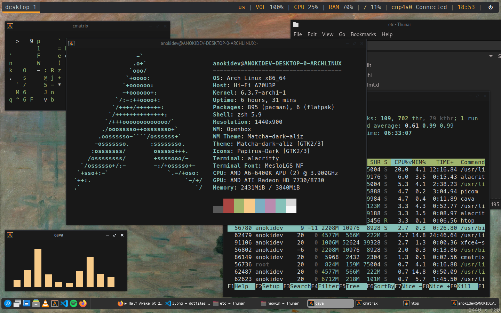
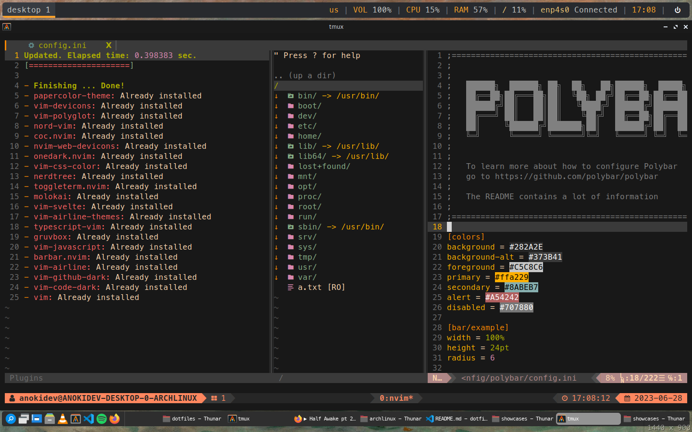

<h1>My Setup</h1>

---------------------------------------

This is my setup, most of them are FOSS softwares.

---------------------------------------

This part explains my dotfiles.

## Images and Music:

For wallpaper, I use a famous 1872 painting "Impression, Sunrise" which you can download from wallpaper websites or Wikipedia.
For music used for cava, I use "Topaz - Half Awake Pt. 2" which is just an EDM music, nothing fancy.

## Softwares:

Here is the list of softwares that I use:

### System:

| Components               | Softwares                                             | 
| :----------------------: | :---------------------------------------------------: |     
| Operating System         | Arch Linux                                            |
| Shell                    | Z Shell + Oh-My-Zsh                                   |
| Package Manager          | Pacman + Yay + Flatpak                                |
| Windowing System         | Xorg                                                  |
| Display Manager          | SDDM                                                  |
| Window Manager           | Openbox                                               |
| Status Bar               | Polybar                                               |
| Task Bar                 | Tint2                                                 |
| File Manager             | Thunar File Manager                                   |
| Settings Manager         | Obconf + LxAppearance                                 |
| Service Manager          | Systemd                                               |
| Bootloader Manager       | GNU/GRUB                                              |
| Sound Server System      | Pulseaudio + Pavucontrol                              |
| Terminal                 | Alacritty + XTerm                                     |
| GUI Editor               | Visual Studio Code + Gedit                            |
| CLI Editor               | Neovim + Nano + Emacs                                 |
| Web Browser              | Mozilla Firefox                                       |
| Media Player             | VLC Media Player                                      |
| Image Viewer             | Gwenview                                              |
| Music Streaming Service  | Spotify Client for Linux                              |
| Application Search       | XFCE4 App Finder                                      |
| Screenshooter            | XFCE4 Screenshooter                                   |
| FTP Client               | FileZilla                                             |
| Task Manager             | GNOME System Monitor + Htop                           |

### Shell Environment :

| Components               | Softwares                                             | 
| :----------------------: | :---------------------------------------------------: |
| Shell                    | Z Shell                                               |
| Plugin Manager           | oh-my-zsh                                             |
| Shell Theme              | Spaceship Prompt (oh-my-zsh plugin)                   |
| Auto Suggestion          | zsh-autosuggestions (oh-my-zsh plugin)                |
| Syntax Highlighting      | zsh-syntax-highlighting (oh-my-zsh plugin)            |
| CLI Task Manager         | Htop                                                  |
| CLI Clock                | Peaclock                                              |
| Audio Visualizer         | Cava                                                  |
| Non-essential            | Derek Taylor's Colorscript                            |

### SDDM:

| Components               | Themes                                                | 
| :----------------------: | :---------------------------------------------------: |
| Theme                    | Derek Taylor's Multicolor SDDM Theme + Gruvbox Dark   |
| Cursor                   | Adwaita                                               |

### Personalization:

| Components               | Softwares                                             | 
| :----------------------: | :---------------------------------------------------: |
| Icons                    | Papirus-Dark Yaru Theme                               |
| GTK                      | Matcha Dark Aliz                                      |
| Kvantum                  | Gruvbox Dark Brown                                    |
| Cursor                   | Adwaita                                               |

### Visual Studio Code:

| Components               | Extensions                                            | 
| :----------------------: | :---------------------------------------------------: |
| Color Theme              | Gruvbox Dark Hard                                     |
| File Icon Theme          | Grubbox Material Icon Theme                           |
| Product Icon Theme       | Developer's Icons                                     |
 
### Neovim:

| Components               | Plugins                                               | 
| :----------------------: | :---------------------------------------------------: |
| Code Completion          | COC + Polygot                                         |
| File Manager             | NERDTree                                              |
| File Tab                 | barbar.nvim                                           |
| Terminal                 | toggleterm.nvim                                       |
| Status Bar               | Vim Airline + Vim Airline Themes                      |
| Icons                    | Vim Devicons + NVim Web Devicons                      |
| Code Themes              | Gruvbox Dark                                          |
| Others                   | Vim CSS Color                                         |

---------------------------------------

That's it!
