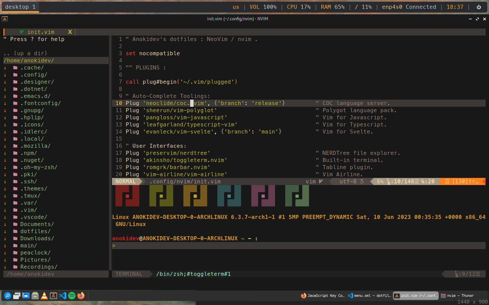

		<h1>Neovim Configuration Files</h1>
		

This contains the configuration files for my Neovim.

**NOTICE:**
- This configuration file uses a plugin manager that is called vim-plugged.
- If you use this configuration file, Neovim will use system clipboard as the clipboard to use. I am using Xclipboard for my system clipboard.
- Backup system is disabled, the width of shift is 4 (not 2), the encoding and the file encoding is UTF-8.
- I am using COC as my auto-completion plugin. The file 'coc-settings.json' is used for configuring COC plugins.
- MesloLGS NF is required.
