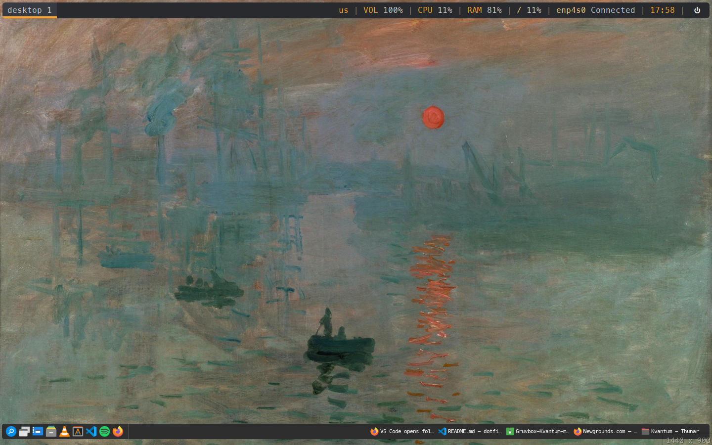

		<h1>Openbox Configuration Files</h1>
		

This contains the configuration files for my Openbox.

**NOTICE:**
- This configuration file is written specifically to use Papirus Dark icons.
- MesloLGS Nerd Font is required. The file that I use is the file that I downloaded from Powerlevel10k repository.
- Several applications here are required:
	- Mozilla Firefox.
	- Spotify Client for Linux.
	- XFCE4 App Finder.
	- VLC Media Player.
	- Qt Library.
	- Visual Studio Code.
	- GNU Emacs.
	- GNOME Gedit.
	- Python and IDLE.
	- Alacritty.
	- XTerm.
	- FileZilla.
	- Thunar File Manager.
	- LxAppearance.
	- systemd.
