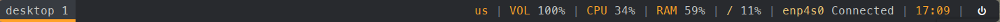

<div style="display: flex; justify-content: center; flex-direction: column;" align="center">
		<h1>Poylbar Configuration Files</h1>
		
</div>

This contains the configuration files for my Polybar. Execute ```launch.sh``` to launch Polybar. If you use my Openbox autostart configuration, the line for executing ```launch.sh``` is already included.

**NOTICE:**
- MesloLGS Nerd Font is required. The file that I use is the file that I downloaded from Powerlevel10k repository.
- Several applications here are required:
	- Pavucontrol GUI.
