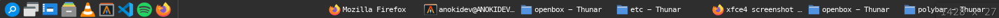

<div style="display: flex; justify-content: center; flex-direction: column;" align="center">
		<h1>Tint2 Configuration File</h1>
		
</div>

This contains the configuration files for my Tint2. Execute ```tint2``` (Assuming you don't have custom path for your configuration file, if you have consult to ```tint2 --help```) to launch Tint2.

**NOTICE:**
- This configuration file is written specifically to use Papirus Dark icons.
- MesloLGS Nerd Font is required. The file that I use is the file that I downloaded from Powerlevel10k repository.
- Several applications here are required:
	- Mozilla Firefox.
	- Spotify Client for Linux.
	- XFCE4 App Finder.
	- VLC Media Player.
	- Visual Studio Code.
	- Openbox.
	- Alacritty.
	- Thunar File Manager.
	- LxAppearance.
