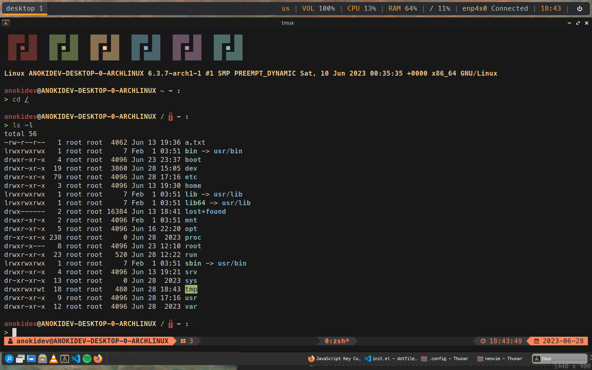

		<h1>Tmux Configuration File</h1>
		

This contains the configuration files for my Tmux. Note that you have to install TPM first.

**NOTICE:**
- MesloLGS NF is required.
- TPM (Tmux Plugin Manager) is used as the plugin manager for Tmux.