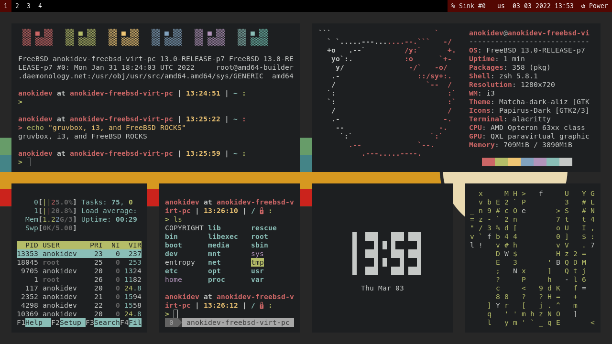
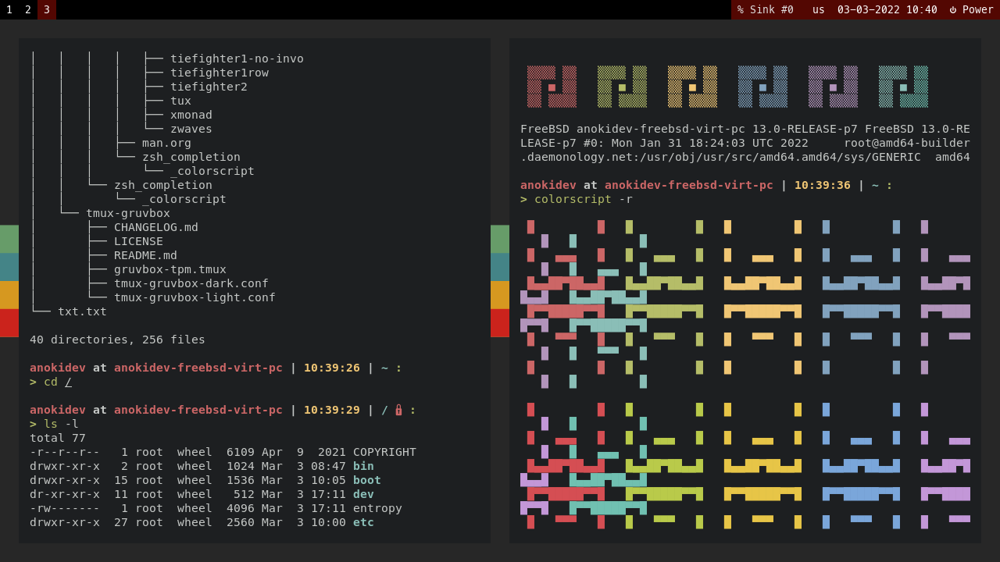
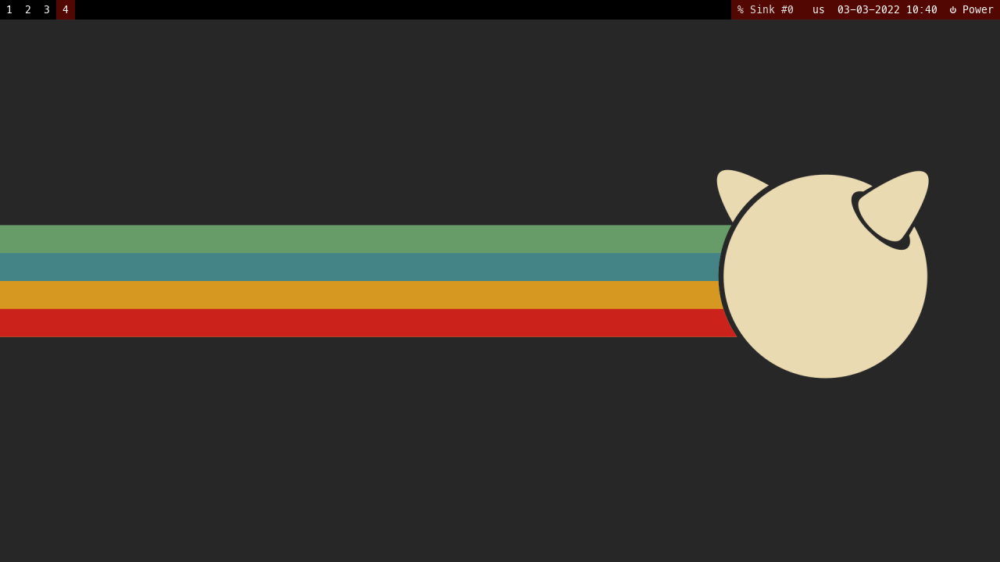

<h1>My FreeBSD Rice Dotfiles</h1>

----

Hello there my friend ! This is the dotfiles
that I used to rice my FreeBSD VM. All of them
are based on 1 theme, Gruvbox Dark !

Click [here](https://www.reddit.com/r/wallpaper/comments/kezpb9/1920x1080_all_resolutions_available_dark_light/) 
to download the wallpaper.

----

- OS : FreeBSD 13.0-RELEASE Patch Level 7 .
- Shell : ZSH + oh-my-zsh + Spaceship Prompt Theme .

----

- WM : i3wm gaps / i3-gaps .
- Status bar : Polybar .

----

- Terminal : Alacritty .
- Multiplexer : Tmux .
- Editor : Neovim + vim-plug + coc.nvim .

----

NOTES :

- You need ZSH AND oh-my-zsh in order to install the prompt theme.
- Not only that, you also need [Colorscript](https://gitlab.com/dwt1/shell-color-scripts) for the prompt greeting.
- You need to install the [Nerd font](https://github.com/romkatv/dotfiles-public/tree/master/.local/share/fonts/NerdFonts) (MesloLGS NF) .

- For i3-gaps, you need to use X11, not Wayland. You also need Polybar and Feh.
- For Polybar, you need a script file named [pulseaudio-control](https://github.com/marioortizmanero/polybar-pulseaudio-control), which requires Pulseaudio.
- You need feh to set the wallpaper.

- You need vim-plug in order to install all of the Neovim plugins.
- For coc.nvim (Autocompletion tool for Neovim) , you need Node.JS. 
- Node.JS requires patch level 7 for FreeBSD 13.0 .

- Certain keybindings for i3-gaps requires Thunar, Flameshot, xfce4-settings-manager, and Chromium.
