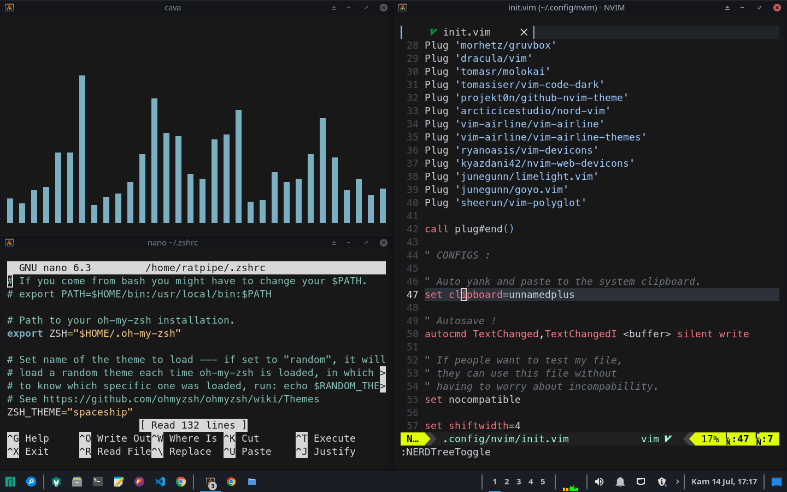
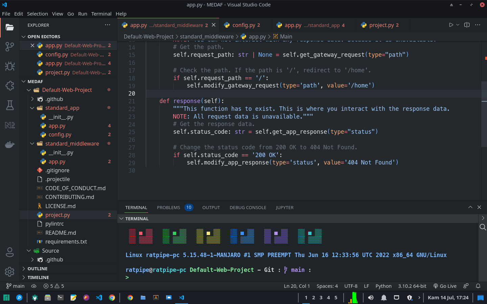
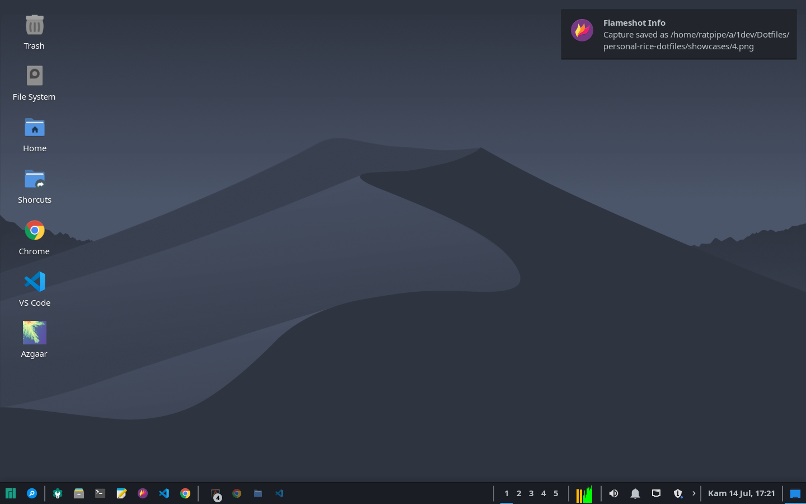

<h1>My Setup</h1>

---------------------------------------

This is my setup, most of them are FOSS softwares.

---------------------------------------

This part explains my dotfiles.

## NOTES :

Note that i3-gaps config is written to interact with Polybar. Note that MesloLGS NF font is required. oh-my-zsh, Spaceship Prompt theme, zsh-syntax-highlighting, and zsh-auto-suggestions are required.

For wallpaper, click [here](https://imgur.com/gallery/ZE9ZvL4).
For music used for cava, click [here](https://topazzz.bandcamp.com/album/half-awake-ep).

## SPECS :

This contains all the script file and config file that I use to configure the apps that I use for programming.

**NOTE** : Taken from CPU - X and neofetch.

- Processor : AMD A5-5400K APU + Radeon HD Graphics.
- RAM : Dual Card DDR 3 , Total 6 GB.
- Graphics Card : AMD ATI Radeon HD 7730/8730.

#### Setup :

- OS : Manjaro Linux| Microsoft Windows 7 Ultimate.
- Shell : Windows - Batch | Manjaro : ZSH + Spaceship Prompt.
- GUI : Windows Shell | X11 + xfce4.

#### Tools :

- Terminal : Alacritty .
- Source control and repo manager : Git + GitHub.

#### Editor :

- Editor : VS Code (Main) | Neovim and Mousepad (Simple Editing) | Nano (Emergency).
- Extensions Manager : Neovim - vim-plug.
- Auto - Completion : VS Code - Intellesense | NeoVim - COC + auto-pairs.

#### Fonts :

- MesloLGS NF Regular Powerline 15 (Monospace Font).
- Noto Sans Medium 10 (Regular Font).
- Source Code Pro 10 (Status Bar Font).

#### Themes :

- System : matcha-dark-azul [GTK 2/3].
- NeoVim : github-nvim-theme.
- VS Code : Github Dark.
- Mousepad : Oblivion.
- Bash : Default Manjaro.
- ZSH : Spaceship Prompt.

#### Icons :

- System : Papirus-Dark [GTK 2/3].
- NeoVim : vim-devicons.
- VS Code : Developer's Icon Theme (Product icon theme) | VSCode Icons (File icon theme).

---------------------------------------

That's it !
